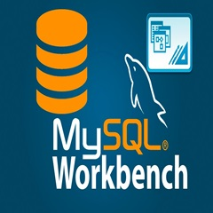

# Software de Inventario 

## Acerca del software
Éste software de Inventario es una aplicación web que se encarga de manipular todo el control de los materiales disponibles para el área de soporte TI guardados de manera Física en un Data Center

## Tecnologías Usadas en el desarrollo y productivo

    php  8.0 (8.0.30)

    laravel 10

    html:5 
    estilos css
    json

    Xampp release 8.2.4, 8.1.17 and 8.0.28

    composer version 2.6.6

    
    Nodejs version 20.10.0

    Mysql Workbench latest version

    latest version included in Laravel 10

    Bootstrap

    Github incorporates a preferred code editor

## Instalación de dependencias y herramientas a utilizar
*Abra una terminal dentro de su editor de código estando dentro de la carpeta raíz de su proyecto y ejecute uno por uno los siguientes comandos:*

Instalacíon del paquete de Nodejs

    npm install node

Instalacion del paquete de Composer

    composer install

## Conexion a la base de datos
*Dirijase a la carpeta dentro de su proyecto y busque el archivo de configuracion ".env" , una vez dentro ingrese el NOMBRE DE LA BASE DE DATOS A UTILIZAR, NOMBRE DE USUARIO y por último la CONTRASEÑA DE INGRESO A LA BASE DE DATOS. Encontrará una estructura como la siguiente:*

    APP_NAME=Laravel
    APP_ENV=local
    APP_KEY=base64:ALebxZ+m4T4EkBCNe5ebTi/3PJe9xPXlEBAJt3G89k0=
    APP_DEBUG=true
    APP_URL=http://localhost

    LOG_CHANNEL=stack
    LOG_DEPRECATIONS_CHANNEL=null
    LOG_LEVEL=debug

    DB_CONNECTION=mysql
    DB_HOST=127.0.0.1
    DB_PORT=3306
    DB_DATABASE= -------->NOMBRE DE LA BASE DE DATOS<-----
    DB_USERNAME= ----------->NOMBRE DE USUARIO<-----
    DB_PASSWORD= ------>CONTRASEÑA DE LA BASE DE DATOS<-----

    BROADCAST_DRIVER=log
    CACHE_DRIVER=file
    FILESYSTEM_DISK=local
    QUEUE_CONNECTION=sync
    SESSION_DRIVER=file
    SESSION_LIFETIME=10
    ......

*Una vez tenga creada su base de datos y el archivo .env listo ejecute el siguiente comando para hacer las migraciones de tablas a su base de datos:*

    php artisan: migrate